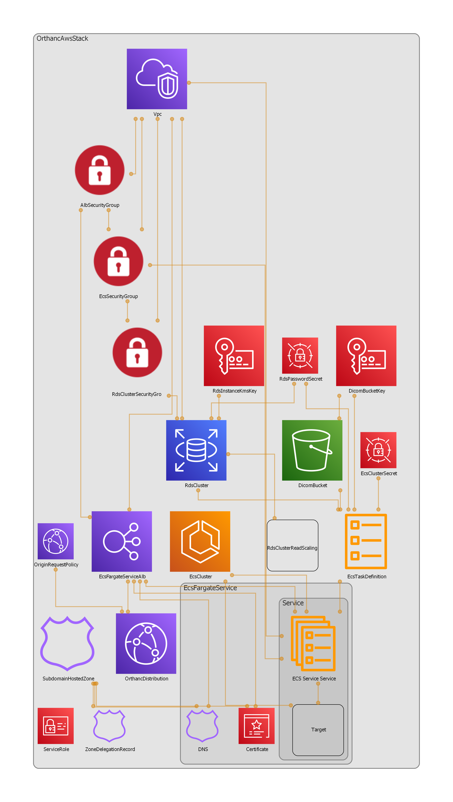

Orthan server in AWS
=====================

Orthanc server https://www.orthanc-server.com/.

Features
---------

|check| autoscaling

|check| auto-recovery

|check| cloudwatch logs

|uncheck| loadbalancer SSL offloading

|check| publicly accessible

|check| network security

|check| Postgres database.
https://book.orthanc-server.com/plugins/postgresql.html 

https://hub.docker.com/r/jodogne/orthanc-plugins 

|check| content delivery network

Resources
----------

https://book.orthanc-server.com/users/docker.html

Infrastructure
---------------

Regenerate diagram with

.. code-block:: bash

   npx cdk-dia

      
   Orthanc infrastructure on AWS

Deployment
-----------

#. `Install AWS CDK for TypeScript <https://docs.aws.amazon.com/cdk/v2/guide/getting_started.html>`_

   #. Main steps of the CDK installation:
   #. Run ``aws configure`` or set the environment variables AWS_ACCESS_KEY_ID, AWS_SECRET_ACCESS_KEY, and AWS_DEFAULT_REGION to appropriate values.
   #. Install CDK globally in the OS ``yarn global add aws-cdk``
   #. Prepare AWS storage required for the CDK to work ``cdk bootstrap aws://ACCOUNT-NUMBER/REGION``

#. Download project ``git clone https://github.com/gmeligio/orthanc_aws.git && cd orthanc_aws``
#. Install NodeJS dependencies ``yarn install``
#. Deploy to AWS ``cdk deploy``. The command takes between 15-20 min to deploy.
#. Once the command ``cdk deploy`` command is completed, get from the terminal output:
   
   #. Load balancer URL
   #. Cloudfront distribution URL
   #. Orthanc credentials secret key.

#. Get Orthanc credentials (username and password) from Secrets Manager ``aws secretsmanager get-secret-value --secret-id {ORTHANC_CREDENTIALS_SECRET_KEY}``

.. |check| unicode:: U+2611
.. |uncheck| unicode:: U+2610
