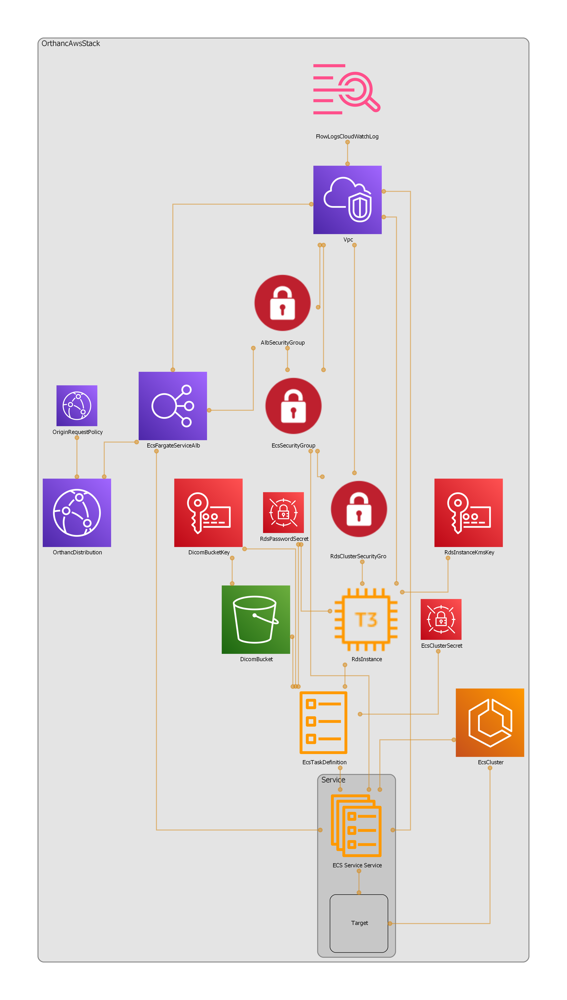

Orthan server in AWS
=====================

Orthanc server https://www.orthanc-server.com/.

Features
---------

|uncheck| autoscaling

|check| auto-recovery

|check| cloudwatch logs

|uncheck| loadbalancer SSL offloading

|check| publicly accessible

|check| network security

|check| Postgres database.
https://book.orthanc-server.com/plugins/postgresql.html 

https://hub.docker.com/r/jodogne/orthanc-plugins 

|check| content delivery network

Resources
----------

https://book.orthanc-server.com/users/docker.html

Infrastructure
---------------

Regenerate diagram with

.. code-block:: bash

   npx cdk-diag --target ./docs/diagram.png

      
    Orthanc infrastructure on AWS

Deployment
-----------

#. Set the environment variables AWS_ACCESS_KEY_ID, AWS_SECRET_ACCESS_KEY, and AWS_DEFAULT_REGION to appropriate values.

WIP

.. |check| unicode:: U+2611
.. |uncheck| unicode:: U+2610

